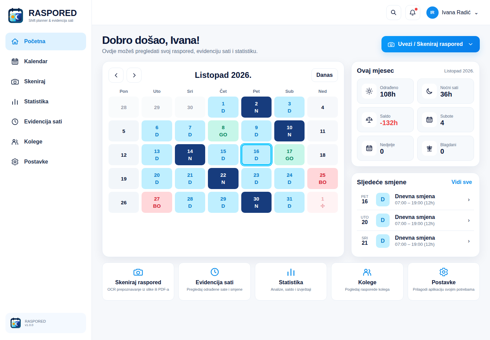
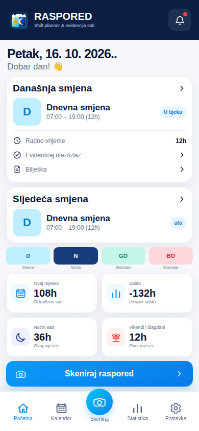
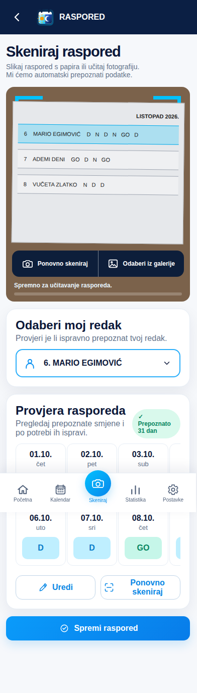
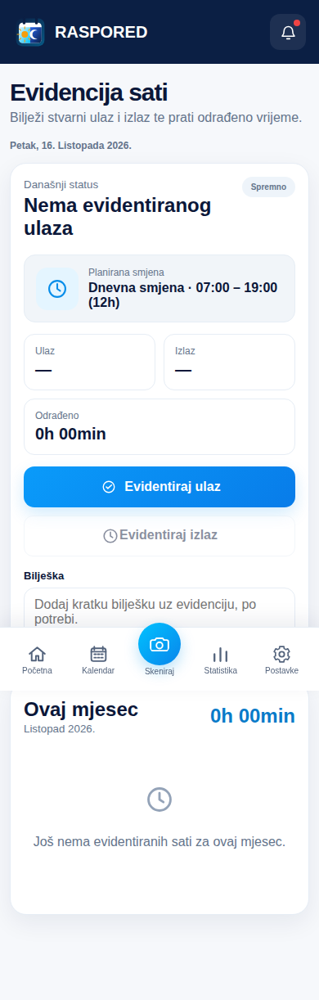
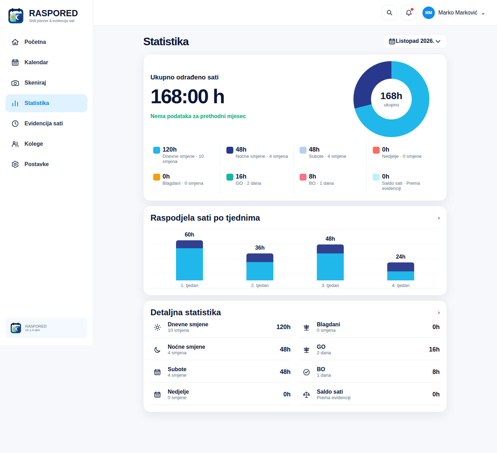
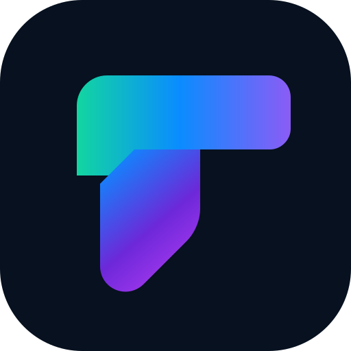
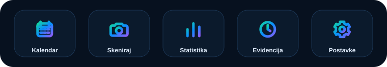

# RASPORED

### Smjene, evidencija sati i statistika — u jednoj modernoj aplikaciji.

**RASPORED** pretvara papirnate rasporede u pregledan digitalni kalendar, povezuje planirane smjene sa stvarno odrađenim vremenom i daje jasan mjesečni pregled rada na **Androidu** i kao **Web/PWA** aplikacija.

**Android · Jetpack Compose · Kotlin · ML Kit OCR · Web/PWA · Playwright**

---

## Preuzimanja

Svako produkcijsko izdanje objavljuje gotove artefakte:

- **RASPORED.apk** — instalabilna Android aplikacija.
- **RASPORED-web-vX.Y.Z.zip** — Web/PWA paket spreman za upload na domenu, poddomenu ili poddirektorij.
- **SHA256SUMS-vX.Y.Z.txt** — kontrolne vrijednosti za provjeru preuzetih datoteka.

Verzija Android aplikacije i Web/PWA paketa uvijek se čita iz zajedničke datoteke <code>VERSION</code>. CI ne dopušta novo izdanje s već korištenom verzijom.

## Raspored bez tablica, papira i ručnog prepisivanja

RASPORED je napravljen za korisnika koji želi brzo vidjeti **kada radi, koju smjenu ima, koliko je stvarno odradio i kakav mu je saldo sati**.

Aplikacija spaja pet glavnih tokova u jedno sučelje:

- **Kalendar smjena** — glavni početni ekran; D, N, GO, BO, PD i SD mogu se uvesti skeniranjem ili ručno postaviti za bilo koji datum.
- **Skeniranje rasporeda** — kamera ili galerija; Android koristi on-device ML Kit OCR.
- **Evidencija sati** — ulaz, izlaz, bilješka, trajanje rada i mjesečna povijest.
- **Statistika** — dnevni/noćni sati, saldo, vikendi, blagdani i raspodjela po tjednima.
- **Android + Web/PWA** — isti vizualni identitet i ista semantika podataka na obje platforme.

## Stvarna aplikacija

> Slike ispod su **stvarni screenshotovi pokrenute Web/PWA aplikacije**, generirani automatski u GitHub Actions / Playwright QA procesu. Nisu mockupovi, renderi ni dizajnerske reference. Screenshotovi koriste izmišljene testne podatke i izmišljena imena; ne koriste stvarne osobe ni rasporede iz korisničkih fotografija.

### Mobilni prikaz

<table>
<tr>
<td width="33%" align="center"><b>Početna</b></td>
<td width="33%" align="center"><b>Skeniranje rasporeda</b></td>
<td width="33%" align="center"><b>Evidencija sati</b></td>
</tr>
<tr>
<td></td>
<td></td>
<td></td>
</tr>
</table>

### Statistika rada

## Što RASPORED radi

| Funkcija | Što korisnik dobiva |
| --- | --- |
| **Mjesečni kalendar** | Početni ekran aplikacije s pregledom smjena, hrvatskih blagdana i ručnim uređivanjem D / N / GO / BO / PD / SD oznaka po danu te vlastitih kratkih oznaka do 8 slova/brojeva. |
| **D / N / GO / BO / PD / SD model** | Jednostavna i konzistentna semantika smjena, dopusta, bolovanja i slobodnog dana kroz cijelu aplikaciju. |
| **OCR na Androidu i Web/PWA** | Cijela fotografija rasporeda obrađuje se u više prolaza. Uz puni kadar koriste se detekcija tablice, preklapajući pojasevi, zasebni roster prolazi i fokusirani 2D recovery tileovi za vrlo guste rasporede; osobe i stupci dana spajaju se po broju retka/geometriji bez komprimiranja praznih dana. |
| **Evidencija ulaza/izlaza** | Stvarno odrađeno vrijeme više nije isto što i planirano vrijeme. |
| **Saldo sati** | Razlika između planiranih i stvarno evidentiranih minuta. |
| **Noćni / vikend / blagdan sati** | Poseban pregled vremena odrađenog u relevantnim kategorijama. |
| **Tjedna statistika** | Vizualna raspodjela rada po tjednima u mjesecu. |
| **Dark mode** | Trajna Android postavka tamnog izgleda. |
| **PWA app shell** | Web aplikacija registrira service worker za UI assete; podatkovni API ostaje network-only kako se osobni JSON ne bi spremao u cache. |
| **Okvirna plaća** | Android i Web/PWA koriste provjerljive 2026 parametre gdje postoje; lokalno uređeni i privatni sektor imaju ručni način bez izmišljanja osnovice, koeficijenta ili dodataka. |
| **Web korisnički račun** | Web/PWA može raditi bez registracije, a račun je opcionalan za trajni pristup web podacima. Android nema korisnički račun i sve glavne funkcije radi lokalno bez registracije. |
| **Izvoz** | Android generira stvarni mjesečni PDF; Web/PWA podržava JSON sigurnosnu kopiju i pregled za ispis / spremanje kao PDF. |
| **Responsive UI** | QA se provodi na 375, 390, tablet, 1440 i 1920 px viewportima. |

## Kako radi skeniranje

1. **Slikaj raspored** kamerom ili odaberi fotografiju iz galerije.
2. Android koristi **ML Kit OCR**, a Web/PWA browser OCR sloj.
3. Parser traži cijelo zaglavlje 1–28/29/30/31, numerirane retke osoba i oznake **D / N / GO / BO / PD / SD**. Kod gustih tablica koristi dodatne preklapajuće high-resolution prolaze i korekciju perspektive po retku.
4. U osobni kalendar uvozi se **točno jedna odabrana osoba**. Android za to ne traži račun. Ako je puni raspored gust, OCR koristi broj retka kao primarni identitet i dodatne roster prolaze za ime kako ne bi stvarao duplikate ili gubio smjene.
5. Android bez registracije može iz istog skeniranja spremiti više prepoznatih djelatnika kao **odvojene lokalne rasporede tima**. Web zadržava opcionalni korisnički račun i voditeljski način. Rasporedi se nikada ne spajaju među osobama.
6. Prije spremanja moguće je ručno ispraviti svaki dan i oznaku; bez pouzdane geometrije stupaca aplikacija traži ponovno skeniranje umjesto tihog pomicanja dana ulijevo ili udesno.

Web OCR pri prvom korištenju može trebati internetsku vezu za učitavanje OCR modela. Fotografija se obrađuje u pregledniku, a potvrđeni raspored i evidencija spremaju se kroz isti-origin PHP API u per-instalacijski JSON pod `storage/data`.

## Evidencija sati je odvojena od plana

Planirana smjena govori **što bi trebalo biti odrađeno**. Evidencija sati govori **što je stvarno odrađeno**.

RASPORED zato odvojeno vodi:

- vrijeme ulaza,
- vrijeme izlaza,
- trajanje rada,
- bilješku uz evidenciju,
- mjesečni zbroj,
- dnevne i noćne minute,
- vikend i blagdan minute,
- saldo u odnosu na plan.

Home i Statistika koriste stvarnu Evidenciju sati. Planirane smjene i stvarno odrađeno vrijeme vode se odvojeno.

## Oznake rasporeda i Evidencija sati

RASPORED razlikuje planirani raspored od stvarne Evidencije sati. Podržane oznake rasporeda su **D** (dnevna smjena), **N** (noćna smjena), **GO** (godišnji odmor), **BO** (bolovanje), **PD** (plaćeni dopust) i **SD** (odobreni slobodan dan). **Prazna ćelija nije SD**: ostaje prazna i znači redovni slobodni dan. OCR zato nikada ne smije sam pretvarati praznu kućicu u SD niti pomaknuti kasniju oznaku na raniji datum. OCR review zadržava točan dan/stupac i dopušta ručnu korekciju prije spremanja.

Blagdan je svojstvo datuma, a ne posebna oznaka rasporeda. Prazna ćelija na blagdan ostaje prazna i prikazuje se kao blagdan/neradni dan; aplikacija ne dodaje +150 % dodatka ako na taj datum nema stvarno odrađenog rada. Za javne službe TKU predviđa pravo na naknadu plaće kada zaposlenik ne radi zbog državnog blagdana ili neradnog dana, pa taj slučaj ne pretvaramo u BO, SD ili izmišljenu smjenu.

Evidencija sati dodatno razlikuje **redovni rad, 1./2./3. smjenu, turnus, dežurstvo, pripravnost, rad po pozivu i drugi oblik rada**. Trajanje uvijek dolazi iz stvarnog ulaza/izlaza; posebna naknada ne pretpostavlja se ako za nju nema provjerljivog pravila.

## Okvirna plaća — javni sektor i ručni način za ostale poslodavce

Android i Web/PWA imaju zaseban kalkulator **okvirne plaće**, ali kalendar, raspored i evidencija sati ostaju primarna funkcija RASPORED-a. Odabir je organiziran kao **županija ustanove → grad/općina prebivališta i porezne stope → sektor → ustanova → radno mjesto**.

Za 2026. ugrađene su službene osnovice javnih i državnih službi po razdobljima te provjerljivi koeficijenti za odabrana radna mjesta u zdravstvu, školstvu, policiji i profesionalnom vatrogastvu. Web katalog sadrži aktualni popis bolničkih zdravstvenih ustanova Ministarstva zdravstva, a posebna pravila pojedine ustanove ne primjenjuju se na druge ustanove bez provjerljivog izvora.

Vrtići, lokalna i regionalna uprava, privatni poslodavci te drugi slučajevi gdje ne postoji jedna službena državna osnovica/koeficijent koriste **ručni unos**. Privatni sektor je zato dostupan kao zaseban ručni režim: korisnik unosi poznate ugovorene parametre, a aplikacija ne izmišlja nacionalnu vrijednost. Ako radno mjesto nije u katalogu, postoji **Drugo / ručni unos**.

Procjena koristi stvarnu Evidenciju sati za noćni, subotnji, nedjeljni, blagdanski i okvirni prekovremeni rad tamo gdje je stopa za odabrani režim provjerena. Okvirni neto koristi uneseni osobni odbitak i stope grada/općine prebivališta; porez se ne veže uz županiju poslodavca. Prikaz “po radnom danu” samo je prosjek plaće po evidentiranom radnom danu i **nije službena dnevnica za službeni put**.

Kalkulator je pomoćni informativni sloj, ne obračunska isprava. Bolovanje, godišnji odmor po prosjeku, pripravnost, dežurstva, posebni uvjeti rada, neoporezivi primici, prijevoz, obustave i individualna porezna prava ne dodaju se bez odgovarajućeg podatka ili provjerljivog pravila.

## Brand

<table>
<tr>
<td width="50%" align="center">
 
<b>Glavni logo</b> 
Kalendar + dan + noć
</td>
<td width="50%" align="center">
 
<b>PWA / maskable ikona</b> 
Isti proizvodni vizualni identitet
</td>
</tr>
</table>

### Produkcijske ikonice

Ikonice u aplikaciji nisu emoji ni privremeni Unicode placeholderi. Web koristi zajednički SVG sprite iz <code>web/public/assets/brand/icons.svg</code>, a Android koristi platformske vector / Compose ikone uz projektni launcher asset.

### Boje

| Token | Vrijednost | Namjena |
| --- | --- | --- |
| Midnight Navy | <code>#0B1F44</code> | navigacija, noćna smjena, brand |
| Electric Cyan | <code>#00C2FF</code> | primarna akcija, dnevna smjena |
| Teal | <code>#14B8A6</code> | slobodni dan / pozitivni statusi |
| Slate Gray | <code>#94A3B8</code> | sekundarni tekst |
| Background | <code>#F6F8FB</code> | svijetla površina aplikacije |
| Amber | <code>#F59E0B</code> | sunce / naglasci |
| Red | <code>#EF4444</code> | bolovanje / upozorenja |

## Platforme

### Android

- Kotlin
- Jetpack Compose
- Material 3
- ML Kit Text Recognition
- lokalna pohrana rasporeda i evidencije
- okvirna bruto/neto procjena uz službene javne presete i ručni način za ostale sektore
- hrvatski fiksni i pomični blagdani
- funkcionalni dark mode
- lokalni profil i stvarni mjesečni PDF izvoz rasporeda/evidencije
- Compose unit/lint provjere i stvarni emulator launch/navigation smoke test u CI-ju

### Web / PWA

- tanki PHP entrypoint + zasebni viewovi, bootstrap, API i JS moduli
- HTML + CSS + JavaScript
- responzivni layout bez framework ovisnosti u runtimeu
- PWA manifest + service worker
- gostujući per-instalacijski JSON podaci u `storage/data` iza zaštićenog PHP API-ja
- opcionalna registracija/prijava samo za Web/PWA uz `password_hash`, HttpOnly/SameSite session cookie i ograničenje pokušaja prijave
- Web račun koristi zaseban privatni per-account JSON pod `storage/data`
- Web voditeljski profil može spremiti više djelatnika kao odvojene rasporede tima
- JSON sigurnosna kopija i mjesečni pregled za ispis / spremanje kao PDF
- jednokratna migracija starog browser storagea u JSON spremište
- okvirna bruto/neto procjena uz službene javne presete i ručni način za ostale sektore
- Playwright funkcionalni i screenshot QA
- stvarni camera/gallery image-upload tok

## Podrška

- WhatsApp: **+385 91 901 0092**
- E-mail: **info@raspored.eu**
- Developer: **Brendigo Studio** — brendigo.com

## Privatnost i podaci

- **Android:** nema korisničkog računa ni prijave. Kalendar, raspored, OCR, evidencija, statistika, procjena plaće i PDF izvoz rade lokalno bez registracije; aplikacija nema nepotrebnu Internet dozvolu.
- **Web/PWA:** gostujući način koristi per-instalacijski JSON vezan uz nasumični HttpOnly identifikator. Registrirani korisnik koristi zaseban JSON vezan uz nasumični ID računa; e-mail se ne koristi kao naziv datoteke.
- **Računi:** lozinke se ne spremaju u čistom tekstu; koriste PHP `password_hash` / `password_verify`, HttpOnly/SameSite session cookie, same-origin provjeru i ograničenje pokušaja prijave.
- **Zaštita Web spremišta:** runtime prvenstveno sprema JSON u privatni direktorij izvan document root-a; put se može eksplicitno zadati s `RASPORED_STORAGE_DIR`. `storage/.htaccess` ostaje kompatibilni fallback za Apache. Zapis ide kroz API s validacijom, sanitizacijom, ograničenjem veličine, zaključavanjem i atomskim zapisom.
- **Android OCR:** obrada teksta preko ML Kit modela na uređaju.
- **Web OCR:** fotografija se obrađuje u pregledniku; sama fotografija ne zapisuje se u `storage/data`.
- **Legacy migracija:** postojeći podaci iz starog `localStorage/sessionStorage` modela mogu se jednokratno prenijeti u JSON spremište, nakon čega se stari ključevi brišu.

Registracija nije potrebna za osnovni rad. Android nema korisnički račun i sve glavne funkcije radi lokalno. Web/PWA može raditi bez registracije, a opcionalni račun služi samo web pristupu i web voditeljskom načinu.

## QA koji mora proći

Svaki ozbiljniji razvojni pass provjerava:

- PHP syntax,
- Playwright funkcionalne testove,
- screenshot capture,
- responsive Home,
- Calendar i Statistics navigaciju,
- stvarni image-upload tok,
- produkcijski Scan empty state,
- evidenciju ulaza/izlaza i perzistenciju,
- data-driven statistiku,
- JSON storage API, migraciju i zaštitu zapisa,
- okvirnu plaću i perzistenciju odabranog radnog mjesta,
- Android debug APK,
- Android unit testove,
- Compose androidTest compile,
- Android lint.

### Viewporti

<code>375</code> · <code>390</code> · tablet · <code>1440</code> · <code>1920</code>

## Lokalno pokretanje Web/PWA aplikacije

<pre><code>php -S 127.0.0.1:8080 -t web/public</code></pre>

Aplikacija je dostupna na:

<pre><code>http://127.0.0.1:8080/</code></pre>

Kod rada iz repozitorija API zapisuje JSON u <code>web/storage/data/</code>. Produkcijski ZIP sadrži <code>storage/</code> uz javne datoteke aplikacije, pa hosting mora PHP procesu dopustiti zapis u <code>storage/data</code>, dok izravni HTTP pristup toj mapi mora ostati blokiran.

## Struktura repozitorija

<pre><code>RASPORED/
├── android/                 # Android / Jetpack Compose
├── web/                     # Web/PWA aplikacija
│   ├── public/              # entrypoint, views, API, CSS/JS i PWA asseti
│   └── storage/data/        # runtime JSON (nije dio source commita)
├── docs/
│   ├── design/              # dizajnerska pravila i mapiranje referenci
│   └── media/               # stvarni CI screenshotovi i brand media
└── .github/workflows/       # build, test i screenshot QA</code></pre>

## Produkcijski status

RASPORED je pripremljen kao **v1.0.10** aplikacija za Android i Web/PWA. Runtime ne sadrži demo raspored, fiksni razvojni datum ni hardkodirana imena korisnika. QA podaci postoje samo u automatiziranim testovima i ne ulaze u produkcijski UI.

Prije svake objave CI provjerava Android build/test/lint i Web/PWA funkcionalne, responzivne i screenshot testove.

---

**RASPORED**  
*Shift planner & evidencija sati*

